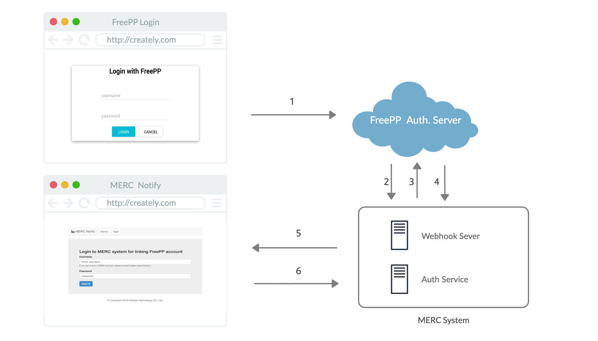

1.Purpose 
========

This is a Webhook server named "MERC Notify" to integrate FreePP Agent with MERC system.

2.MERC Notify Architecture
============================================================

2.1 Steps Description:
------------------

1. MERC System directs user to FreePP Authentication Login Page. FreePP Login page will popup in browser, and user login in as authenticated. Browser shows Profiles List of user’s FreePP account, and user chooses which profile to be approved. Then user agrees to grant the requested permission to MERC System

2. FreePP Authentication Server redirects user back to MERC System via redirect_uri, and return granted code,& state. 

3. MERC System requests access token by “https://pro20.freepp.com/provider/token” endoint with code.

4. FreePP Authentication Server validate MERC System, and returns access token, and refresh token. MERC System could get pid in user profile via access token.

5. Response a login page to user with web GUI. 

6. When user login successfully, MERC System links pid with the user for notificaion.
